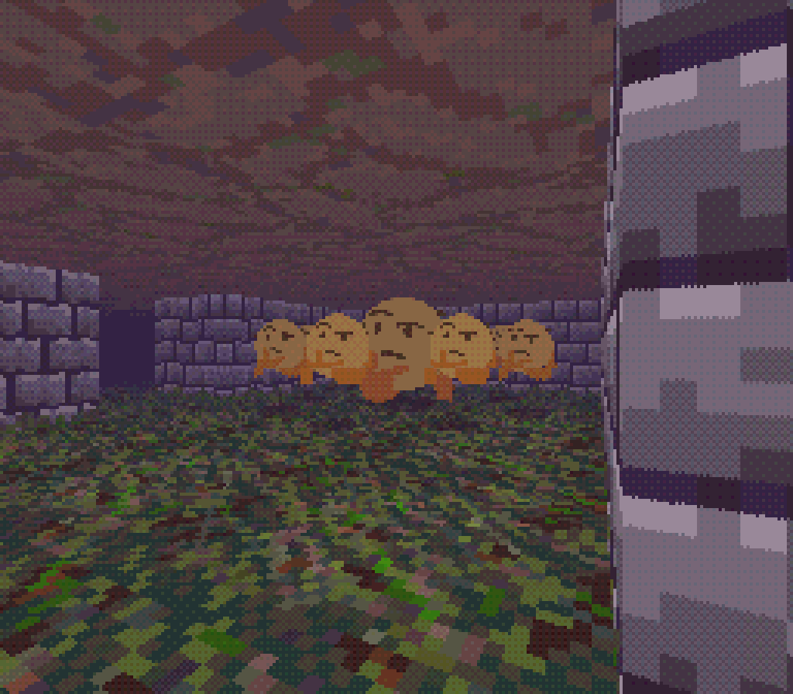

# c-raycaster project

Connor Ennis, 2019-2020

A basic raycaster engine built in C using SDL2. This is a messy expirement at the moment and more of a learning exercise than anything. I'll be adding more features over time, but for now it has basic functionality and can load simple maps.

Now with sprites: Not fully implemented yet but they render! That's a thing.

WARNING: This project is very much a wip ~~and doesn't even have a makefile yet~~ (Just added!). I'll be sure to add more info as stuff progresses (including documentation, which is currently very lacking) but this is an expirement so it will never be a particularly good engine. If you want something to use for your own game, with multiple level support ~~and texturing~~ (now added) and all of that other jazz (that actually runs well, RIP optimization), there's plenty of other stuff online.

Update: Now there's a makefile. (Yay!)

Controls:
- w, s to move forward and backwards
- q, e to strafe left and right, respectively
- a, d to rotate counterclockwise and clockwise (respectively, duh)
- shift to sprint in literally every direction (minus turning, personal preference)
- left control to crouch
- k to, er, kill the player
- r to respawn when dead

Features / Goals:
- [x] Textured grid-based raycasting on a single plane
- [x] Pixel scaling, dithering, and palletization
- [x] Automatic texture scaling
- [x] Gradient and rectangle drawing, as well as arbitrary pixel drawing functions
- [x] 3D sprites with depth buffering, alpha transparency, animation, height and scaling
- [x] 2D overlay sprites with alpha transparency and scaling
- [x] Depth fog (sort of)
- [x] Alpha translucency and multi-collision ray tracing with supported textures
- [x] Adjustable player controls and maps
- [x] Map collisions
- [x] Floors / Ceilings
- [ ] AI and collisions for entities
- [ ] More complex sprite handling
- [ ] Improved memory management
- [ ] Mapable floors / ceilings
- [ ] Scrolling skyboxes (currently in progress)
- [ ] Multi-level maps with transitions/procedural generation
- [x] Player height
- [ ] More pixel shaders
- [ ] Full overlays
- [ ] Text engine
- [ ] Audio engine
- [ ] Single-plane offset walls
- [ ] Animated wall textures
- [ ] Interactive objects
- [ ] Additional, better reference artwork (I'm doing my best, it takes practice) (currently in progress)
- [ ] Controller support (yes, UDXS, including the Steam controller)
- [ ] Player information (inventory, health, etc)
- [ ] Maybe make an actual game with this thing???
- [ ] *Actual documentation* D:
- [ ] Oh yeah, probably a state system for events. Might be nice.
- [ ] More things for doing things with things. Yeah.
